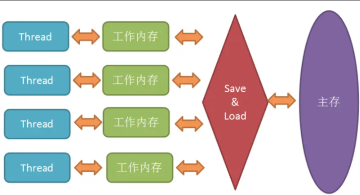

Java虚拟机规范试图定义一种Java内存模型（JMM）,来屏蔽掉各种硬件和操作系统的内存访问差异，让Java程序在各种平台上都能达到一致的内存访问效果。
简单来说，由于CPU执行指令的速度是很快的，但是内存访问的速度就慢了很多，相差的不是一个数量级，所以搞处理器的那群大佬们又在CPU里加了好几层高速缓存。
在Java内存模型里，对上述的优化又进行了一波抽象。JMM规定所有变量都是存在主存中的，类似于上面提到的普通内存，
每个线程又包含自己的工作内存，方便理解就可以看成CPU上的寄存器或者高速缓存。所以线程的操作都是以工作内存为主，
它们只能访问自己的工作内存，且工作前后都要把值在同步回主内存。
这么说得我自己都有些不清楚了，拿张纸画一下： <br/>



#多线程中，线程1中本地线程中的值改变之后，什么时候才会刷新到主内存中去呢？为什么有时候能刷新到主内存中去，有时候又不能刷新呢？？？


###一个解释：
```text
在多线程的环境下，如果某个线程首次读取共享变量，则首先到主内存中获取该变量，然后存入工作内存中，以后只需要在工作内存中读取该变量即可。
同样如果对该变量执行了修改的操作，则先将新值写入工作内存中，然后再刷新至主内存中。
但是什么时候最新的值会被刷新至主内存中是不太确定的，这也就解释了为什么VolatileFoo中的Reader线程始终无法获取到init_value最新的变化。
· 使用关键字volatile，当一个变量被volatile关键字修饰时，对于共享资源的读操作会直接在主内存中进行（当然也会缓存到工作内存中，当其他线程对该共享资源进行了修改，
    则会导致当前线程在工作内存中的共享资源失效，所以必须从主内存中再次获取），对于共享资源的写操作当然是先要修改工作内存，但是修改结束后会立刻将其刷新到主内存中。
    
· 通过synchronized关键字能够保证可见性，synchronized关键字能够保证同一时刻只有一个线程获得锁，然后执行同步方法，
    并且还会确保在锁释放之前，会将对变量的修改刷新到主内存当中。
    
· 通过JUC提供的显式锁Lock也能够保证可见性，Lock的lock方法能够保证在同一时 刻只有一个线程获得锁然后执行同步方法，
    并且会确保在锁释放（Lock的unlock方法）之前会将对变量的修改刷新到主内存当中。

摘自：《Java高并发编程详解：多线程与架构设计》 — 汪文君
```


###一个例子：
```text

描述：thread2和Thread1 会同时去操作一个object对象，
thread2运行后，输出的 是1和11，在Thread1启动后，会改变object的字段值，这时候thread2循环输出的也变了，变成了a和11.

思考：
①每个线程都有自己的工作内存，会把object对象（字段为1,11）拷贝一份到thread2和Thread1的各自工作内存，第一次 thread2输出字段为（1,11）可以理解。
②但是当Thread1  启动后改变了期工作内存的object字段变成（a,11）,
③接下来 thread2输出字段为也变成了 （a,11）
于是接在思考不是有各自的工作内存吗，线程thread1也没有停止啊，为什么线程thread2的工作内存变量也会变掉。

以下是自己的看法：
sleep只是暂停当前线程一定时间，让cpu的高速缓存与内存接下来的若干时钟周期内进行同步（仅是可能，不能完全保证及时），因此或许能读到最新改的值。
如果要保证内存可见性，还是用synchronized，volatile吧，因为二者保证了内存可见性。
然后接下来就是怎么 主内存同步到 线程thread2的工作内存中

这是别人见解：
为了提升性能，线程里面有工作内存，这样访问数据不用去主存读取，可以快一些。共享变量被线程修改后，该线程的工作内存中的值就会和其他线程不一致，
也和主存的值不一致，所以需要将工作内存的值刷入主存，但是这个刷入可能其他线程并没有看到。
使用 volatile 后可以通过 cpu 指令屏障强制要求读操作发生在写操作之后，并且其他线程在读取该共享变量时，
需要先清理自己的工作内存的该值，转而重新从主存读取，volatile 保证一定会刷新，但是不写也不一定其他线程看不见。

就是不一定，有随机性，不加volatile其他线程 也不一定看不见。加了一定看的见。
这就是目前我的理解。
```


##并发三大特性分析(synchronized如何保证内存可见性？)
```text
①原子性
原子性指的是一个或多个操作执行过程中不被打断的特性。被synchronized修饰的代码是具有原子性的，要么全部都能执行成功，要么都不成功。

前面我们提到过，synchronized无论是修饰代码块还是修饰方法，本质上都是获取监视器锁monitor。获取了锁的线程就进入了临界区，锁释放之前别的线程都无法获得处理器资源，保证了不会发生时间片轮转，因此也就保证了原子性。

②可见性
所谓可见性，就是指一个线程改变了共享变量之后，其他线程能够立即知道这个变量被修改。我们知道在Java内存模型中，不同线程拥有自己的本地内存，而且本地内存是主内存的副本。如果线程修改了本地内存而没有去更新主内存，那么就无法保证可见性。

synchronized在修改了本地内存中的变量后，解锁前会将本地内存修改的内容刷新到主内存中，确保了共享变量的值是最新的，也就保证了可见性。

③有序性
有序性是指程序按照代码先后顺序执行。

synchronized是能够保证有序性的。根据as-if-serial语义，无论编译器和处理器怎么优化或指令重排，单线程下的运行结果一定是正确的。而synchronized保证了单线程独占CPU，也就保证了有序性。
```

###指令重排序会出现的问题  来源：【https://juejin.cn/post/6844903520760496141】
```
JMM是允许编译器和处理器对指令重排序的，但是规定了as-if-serial语义，即不管怎么重排序，程序的执行结果不能改变。比如下面的程序段：
double pi = 3.14;     //A
double r = 1;         //B
double s= pi * r * r; //C
上面的语句，可以按照A->B->C执行，结果为3.14,但是也可以按照B->A->C的顺序执行，因为A、B是两句独立的语句，而C则依赖于A、B，所以A、B可以重排序，但是C却不能排到A、B的前面。JMM保证了重排序不会影响到单线程的执行，但是在多线程中却容易出问题。

比如这样的代码:
int a = 0;
bool flag = false;

public void write() {
    a = 2;               //1
    flag = true;         //2
}

public void multiply() {
    if (flag) {          //3
        int ret = a * a; //4
    }
}
假如有两个线程执行上述代码段，线程1先执行write，随后线程2再执行multiply(乘法)，最后ret的值一定是4吗？结果不一定：

如图所示，write方法里的1和2做了重排序，线程1先对flag赋值为true，随后执行到线程2，ret直接计算出结果，再到线程1，这时候a才赋值为2,很明显迟了一步。
这时候可以为flag加上volatile关键字，禁止重排序，可以确保程序的“有序性”，也可以上重量级的synchronized和Lock来保证有序性,它们能保证那一块区域里的代码都是一次性执行完毕的。

另外，JMM具备一些先天的有序性,即不需要通过任何手段就可以保证的有序性，
通常称为happens-before原则。<<JSR-133：Java Memory Model and Thread Specification>>定义了如下happens-before规则：
①程序顺序规则：        一个线程中的每个操作，happens-before于该线程中的任意后续操作
②监视器锁规则：        对一个线程的解锁，happens-before于随后对这个线程的加锁
③volatile变量规则：   对一个volatile域的写，happens-before于后续对这个volatile域的读
④传递性：             如果A happens-before B ,且 B happens-before C, 那么 A happens-before C
⑤start()规则：       如果线程A执行操作ThreadB_start()(启动线程B) ,  那么A线程的ThreadB_start()happens-before 于B中的任意操作
⑥join()原则：        如果A执行ThreadB.join()并且成功返回，那么线程B中的任意操作happens-before于线程A从ThreadB.join()操作成功返回。
⑦interrupt()原则：   对线程interrupt()方法的调用先行发生于被中断线程代码检测到中断事件的发生，可以通过Thread.interrupted()方法检测是否有中断发生
⑧finalize()原则：    一个对象的初始化完成先行发生于它的finalize()方法的开始

第1条规则，程序顺序规则是说在一个线程里，所有的操作都是按顺序的，但是在JMM里其实只要执行结果一样，是允许重排序的，这边的happens-before强调的重点也是单线程执行结果的正确性，但是无法保证多线程也是如此。
第2条规则，监视器规则其实也好理解，就是在加锁之前，确定这个锁之前已经被释放了，才能继续加锁。
第3条规则，就适用到所讨论的volatile，如果一个线程先去写一个变量，另外一个线程再去读，那么写入操作一定在读操作之前。
第4条规则，就是happens-before的传递性。
```


###线程在让出时间片的时候会将自己修改的主内存的值刷新回主内存吗？
```text
首先：不一定会将自己修改的主内存的值刷新回主内存(注意：是不一定)
然后：楼上实例有问题
执行了System.out.println()，我们看源码就知道 println中是有sync锁的,所以写测试代码时，不要写打印语句。
①锁获取的时候会把当前线程的(工作内存)共享变量从主内存重新加载；
②锁释放的时候会把当前线程的(工作内存)共享变量刷新到主内存；
如果，两个线程循环调用，不输出，你就会发现，服务跑一会儿就会处于一直等待中
所以，楼上的实例不对
```
